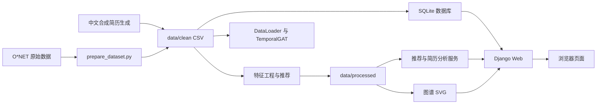
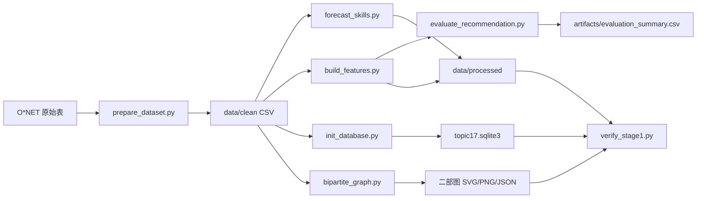
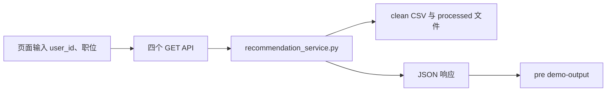
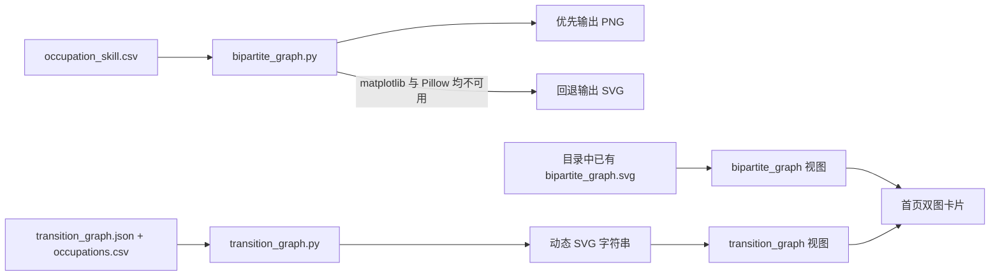
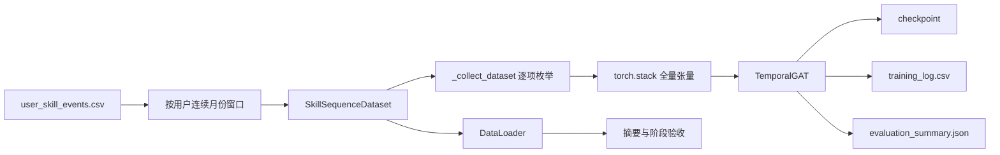

# CareerGraph Recommender 项目代码与数据流说明

## 1. 文档用途与推荐阅读顺序

本文面向**首次接手项目的开发者**，用于从项目全貌逐步定位到实现细节。建议按以下顺序阅读：先读第 2 节确认数据适用边界；再读第 3、4 节理解分层与文件入口；随后按需求阅读第 5、6 节模块索引和第 7 节接口契约；最后结合第 8 至 12 节处理数据、算法、运行和维护工作。

项目是一个课程原型：以职业—技能需求、用户技能事件和职位转移关系为输入，提供可解释的 Top-K 职业推荐、技能缺口、最多三跳职业路径、线性趋势预测、图谱展示和不落库的中文简历即时分析。

## 2. 项目目标与数据真实性边界

职业和技能字典来自公开的 **O*NET 30.2 Database（February 2026，CC BY 4.0）**。`occupations.csv`、`skills.csv` 与 `occupation_skill.csv` 是该公开来源经筛选、规范化得到的项目交换数据。

`resumes_zh.csv`、`user_skill_events.csv` 和 `job_transitions.csv` 是由固定规则、固定随机种子生成的**确定性合成教学数据**；不含真实姓名、电话或邮箱。当前数据摘要记录 12 个职业、35 项技能、300 份简历/用户、63,000 条技能事件和 12 条转移记录。

上传简历仅在当前 HTTP 请求的内存中解析：服务不写 SQLite、不改写 CSV，也不会将文本加入训练集；响应明确返回 `persisted=false`。`evaluation_summary.json` 中的评估只是合成教学数据上的原型验证，**不代表真实招聘市场或真实用户结果**。本版本线性趋势 baseline 的 MAE/RMSE（0.017969 / 0.022436）低于 TemporalGAT（0.116501 / 0.139666），因此不能宣称深度模型效果更好。

## 3. 系统总体架构



CSV 是可审计交换层：离线脚本读写 `data/clean` 和 `data/processed`，可以追溯每个派生结果。SQLite 是 Web 查询层：六张表由 clean CSV 在单个事务中重建。`src` 服务是业务层：计算推荐、缺口、路径、预测和上传文本分析。Django 视图是接口适配层：校验 HTTP 输入、调用服务并返回 JSON/SVG。HTML/JavaScript 是展示层：加载字典、提交表单并将结果放入页面 DOM。

## 4. 项目目录与关键文件

| 目录或文件 | 说明 |
|---|---|
| `data/raw/` | O*NET 原始文件的可选位置；只有执行 `prepare_dataset.py` 或部署参数 `-RefreshFromRaw` 时需要。 |
| `data/clean/` | 可审计的职业、技能、合成简历、事件和转移 CSV，以及 `dataset_summary.json`、`clean_log.csv`。 |
| `data/processed/` | 特征矩阵、Top-K、预测、转移图 JSON 和二部图导出物。 |
| `artifacts/` | `topic17.sqlite3`、阶段验收 JSON、图预览及 `models/` 内训练产物。 |
| `src/` | 数据准备、算法、数据库、模型、图谱、验收和报告生成代码。 |
| `web/` | Django 项目、应用路由、视图和单页前端模板。 |
| `tests/` | 回归测试；不承载生产数据处理逻辑。 |
| `run_all.ps1` | 本机流水线：特征、评估、数据库、二部图和阶段验收；可选训练模型。 |
| `deploy.ps1` | Windows 跨设备部署入口：准备虚拟环境/依赖，调用 `run_all.ps1`，可选启动 Web。 |
| `deploy.bat`、`deploy.sh` | Windows 双击包装器及 macOS/Linux 部署入口。 |
| `README.md` | 环境、运行方式、功能与数据边界的面向使用者说明。 |

以下两节逐一说明“文件结构与职责锁定”中的运行文件。每个条目的输入、输出都以实际读写/调用关系表述；没有文件写入时明确写为 HTTP 响应或内存结果。

## 5. 后端代码逐文件说明

### `src/prepare_dataset.py`

- 作用：从 O*NET 30.2 原始表筛选 12 个职业和技能，并编排合成简历、用户事件和转移数据的清洗。
- 输入：`data/raw` 下的 `Occupation Data.txt`、`Skills.txt`，以及固定职业/转移规则。
- 输出：`data/clean` 的职业、技能、关系、简历、画像、事件、转移、清洗日志和 `dataset_summary.json`。
- 下游：`forecast_skills.py`、`build_features.py`、`init_database.py`、模型训练、图谱和验收。

### `src/generate_chinese_resumes.py`

- 作用：以固定 seed 生成中文技术简历和中英文职业/技能展示名称映射。
- 输入：职业表、职位—技能关系表、技能表、记录数和随机种子。
- 输出：内存中的简历 DataFrame（含 `skill_levels`、`resume_text`、`source=synthetic_chinese_resume`）。
- 下游：`prepare_dataset.py` 写入 `resumes_zh.csv`，`resume_analysis.py` 与 Web 职位接口复用中文名称映射。

### `src/data_integrity.py`

- 作用：检查 clean CSV 外键、重复键、数值范围、转移概率和特征覆盖范围。
- 输入：`data/clean` 的职业、技能、关系、画像、事件、转移 CSV，以及 `data/processed` 的特征输出。
- 输出：机器可读的检查字典，包含各错误集合/数量和汇总 `ok`。
- 下游：`prepare_dataset.py`、`verify_stage1.py` 与测试用于阻止不完整数据继续进入流水线。

### `src/build_features.py`

- 作用：构建用户—职位特征矩阵和 Top-K 推荐结果。
- 输入：`data/clean` 下的职位、技能、用户和转移数据。
- 输出：`job_feature_matrix.csv`、`user_feature_matrix.csv`、`recommendation_features.csv`、`topk_recommendations.csv` 和 `transition_graph.json`。
- 下游：推荐服务、评估脚本、简历即时分析和 Web API。

### `src/forecast_skills.py`

- 作用：按用户、技能的历史等级拟合透明的线性趋势并生成技能预测基线。
- 输入：`data/clean/user_skill_events.csv`。
- 输出：`data/processed/skill_forecast_6m.csv`，含最后等级、月斜率与预测字段。
- 下游：`recommendation_service.py` 的预测接口、运行流水线和验收说明。

### `src/evaluate_recommendation.py`

- 作用：以用户标注的目标职位为相关项，计算离线 Top-K 推荐评价指标。
- 输入：`data/processed/recommendation_features.csv` 与 `data/clean/user_profiles.csv`。
- 输出：`artifacts/evaluation_summary.csv`，写入 Precision@K、Recall@K、NDCG@K。
- 下游：`run_all.ps1`、最终报告生成与人工验收。

### `src/recommendation_service.py`

- 作用：为已有用户提供推荐、技能缺口、职业路径和线性趋势预测的 JSON 就绪结果。
- 输入：clean CSV、processed 特征/转移图/预测文件及请求中的用户、职位、Top-K 或月份参数。
- 输出：内存字典，含状态、分数、缺口技能、路径概率或 `linear_trend_baseline` 预测。
- 下游：`web/topic17_app/views.py` 的四个已有用户 API 和对应测试。

### `src/resume_analysis.py`

- 作用：从上传文本识别中英文技能别名，构造临时技能向量并复用混合评分生成动态结果。
- 输入：UTF-8 简历文本、clean/processed CSV、可选当前职位和目标职位。
- 输出：仅内存结果：识别技能、推荐、技能缺口、职业路径和 `persisted=False`。
- 下游：`resume_upload_api` 的 multipart 上传接口；不调用 CSV 或 SQLite 写入。

### `src/database.py`

- 作用：定义六张 SQLite 表、事务导入、完整性检查、行数查询和用户画像查询。
- 输入：clean CSV、数据库路径及用户 ID。
- 输出：`artifacts/topic17.sqlite3` 的 schema/数据，或计数与用户事件查询字典。
- 下游：`init_database.py`、`verify_stage1.py`、Django 系统摘要和数据库相关测试。

### `src/init_database.py`

- 作用：提供从 clean CSV 初始化并装载 SQLite 的命令行入口。
- 输入：`--db-path` 和 `--data-dir` 参数，默认指向 `artifacts/topic17.sqlite3` 与 `data/clean`。
- 输出：创建/更新 SQLite 数据库，并打印数据库路径和六表行数 JSON。
- 下游：`run_all.ps1`、`deploy.ps1` 和手工部署命令。

### `src/data_loader.py`

- 作用：把用户逐月技能事件转换为 PyTorch 时序样本，并生成职位—技能、职位转移、技能共现图张量。
- 输入：clean 的技能、事件、职位—技能和职位转移 CSV，以及 batch/窗口参数。
- 输出：`DataLoader`、元数据和边索引/权重张量；样本 `x` 为连续窗口、`y` 为下一月向量。
- 下游：`train_temporal_gat.py`、`verify_stage1.py`、Django 系统摘要和模型测试。

### `src/temporal_gat.py`

- 作用：定义轻量 TemporalGAT：每技能 GRU 编码、带权邻居聚合、多头线性投影并预测下一期等级。
- 输入：张量 `x`、可选技能图 `edge_index` 和 `edge_weight`。
- 输出：形状为 `[batch, num_skills]`、范围为 0 到 1 的预测技能向量。
- 下游：`train_temporal_gat.py` 训练/评估和 TemporalGAT 前向测试。

### `src/train_temporal_gat.py`

- 作用：以固定随机种子训练 TemporalGAT，按确定性样本列表顺序切分数据并与线性 baseline 比较。
- 输入：clean CSV、可选 PyTorch 依赖，以及 CLI 开放的 data-dir、artifact-dir、epochs、seed 参数；hidden_dim、heads、learning_rate 仅能通过 Python API 传入。
- 输出：`artifacts/models/temporal_gat.pt`、`training_log.csv` 和 `evaluation_summary.json`。
- 下游：`model_info_api`、`verify_stage1.py`、模型测试和最终报告。

### `src/bipartite_graph.py`

- 作用：从职位—技能关系构建二部图，并导出完整结构和阈值过滤后的可视化。
- 输入：`data/clean/occupations.csv`、`skills.csv`、`occupation_skill.csv` 与最小需求权重。
- 输出：`data/processed/bipartite` 下的 JSON、边 CSV、摘要 JSON，以及优先生成的 PNG；若 matplotlib 与 Pillow 均不可用则改为生成 SVG。当前 Web 读取目录中已有的 SVG 文件。
- 下游：`bipartite_graph` Django 资源视图、首页图卡、验收和报告。

### `src/transition_graph.py`

- 作用：读取职位转移关系，计算布局并按当前数据动态渲染职业转移概率 SVG。
- 输入：`data/processed/transition_graph.json` 和 `data/clean/occupations.csv`。
- 输出：内存 SVG 字符串，不在该请求过程中写图文件。
- 下游：`transition_graph` Django 资源视图和首页第二张图卡。

### `src/create_final_report.py`

- 作用：汇总数据、数据库、特征、二部图、模型和 Web 证据，生成最终 Word 报告。
- 输入：clean/processed CSV 与 JSON、SQLite、模型评估 JSON、图像和报告模板配置。
- 输出：`docs/reports/CareerGraph_Recommender_Final_Report.docx`。
- 下游：课程交付的最终汇报文档，不参与在线 Web 请求。

### `src/verify_stage1.py`

- 作用：汇总数据完整性、数据库、特征、DataLoader、图谱、Web 契约、模型和简历数据集的验收结果。
- 输入：项目根目录、`artifacts/topic17.sqlite3`、clean/processed 文件、模型与 Web 源文件。
- 输出：控制台 JSON；当前保存的示例结果为 `artifacts/verify_stage1_final.json`。
- 下游：`run_all.ps1`、`deploy.ps1`、回归验收和交付证据。

## 6. Django Web 与前端代码说明

### `web/manage.py`

- 作用：Django 命令行入口，设置 `web.topic17_web.settings` 后转交管理命令。
- 输入：命令行子命令和环境变量。
- 输出：执行 `check`、`runserver` 等 Django 命令的过程输出。
- 下游：开发者启动和测试命令、`deploy.ps1` 提示的 Web 启动步骤。

### `web/topic17_web/settings.py`

- 作用：配置 Django 应用、模板、中间件、SQLite 数据库、静态设置和网络访问边界。
- 输入：项目目录和可选 `CAREERGRAPH_ALLOW_NETWORK` 环境变量。
- 输出：Django 运行时配置；默认数据库指向 `artifacts/topic17.sqlite3`。
- 下游：`manage.py`、项目级 URL、所有视图与模板渲染。

### `web/topic17_web/urls.py`

- 作用：作为项目级根 URL 配置，将根路径请求包含到 `web.topic17_app.urls`。
- 输入：浏览器发往站点根下的 URL。
- 输出：路由分派到应用 URLConf。
- 下游：`topic17_app/urls.py` 继续匹配首页、API 和 SVG 路径。

### `web/topic17_web/wsgi.py`

- 作用：创建部署服务器使用的 WSGI application 对象。
- 输入：`DJANGO_SETTINGS_MODULE` 环境配置和 WSGI 服务器请求。
- 输出：可调用的 `application`。
- 下游：兼容 WSGI 的部署服务器；本地 `runserver` 也共享同一项目配置。

### `web/topic17_app/apps.py`

- 作用：声明 Django 应用 `web.topic17_app` 的 AppConfig 与默认主键类型。
- 输入：Django 应用加载过程。
- 输出：应用注册配置对象。
- 下游：`INSTALLED_APPS` 初始化、模板和 URL 所属应用识别。

### `web/topic17_app/urls.py`

- 作用：映射首页、八个 JSON API 和两个 SVG 图谱资源到视图函数。
- 输入：根 URLConf 传入的相对路径和 HTTP 方法。
- 输出：调用 `views.py` 中对应视图的路由结果。
- 下游：Django URL 解析、Web 契约验收和浏览器请求。

### `web/topic17_app/views.py`

- 作用：校验请求、读取数据库/产物、调用推荐与简历服务，并适配为 JSON、SVG 或 HTML 响应。
- 输入：HTTP 请求、`topic17.sqlite3`、CSV/JSON/SVG 产物、上传文件和查询参数。
- 输出：系统摘要、模型信息、职业字典、业务结果 JSON，或二部图/转移图 SVG、首页 HTML。
- 下游：`index.html` 的 JavaScript、直接 API 客户端和 Django Web 测试。

### `web/topic17_app/templates/topic17_app/index.html`

- 作用：提供中文单页仪表盘、上传表单、已有用户查询表单、结果区域和两张图谱卡片。
- 输入：Django 注入的 `summary` 与浏览器端对 `/api/*`、SVG 资源的 fetch 响应。
- 输出：初始化职位下拉框，并将格式化 JSON/上传结果渲染到页面 DOM。
- 下游：最终浏览器界面；已有用户结果写入 `<pre id="demo-output">`，上传结果渲染到上传分析区域。

页面脚本启动时调用 `/api/occupations/` 初始化当前/目标职位下拉框；已有用户查询使用 `Promise.all` 并行请求 `/api/recommend/`、`/api/skill-gap/`、`/api/career-path/`、`/api/forecast/`；上传表单以 `FormData` POST 到 `/api/resume-upload/`，同时携带 `resume`、`current_job`、`target_job` 和 Django CSRF token。上传状态会显示“仅内存分析 · persisted=false”，错误则写入相应的状态区。

## 7. Web API 数据接口

| 方法与路径 | 输入 | Django 视图 | 业务模块 | 输出与前端去向 |
|---|---|---|---|---|
| GET `/api/summary/` | 无 | `summary_api` | 数据库、DataLoader、模型评估 JSON、示例用户画像 | 系统摘要 JSON；首页首屏/接口调用方 |
| GET `/api/model-info/` | 无 | `model_info_api` | 模型评估 JSON | 模型元数据 JSON；独立接口调用方（当前首页不请求） |
| GET `/api/occupations/` | 无 | `occupations_api` | `occupations.csv` | 初始化职位下拉框 |
| POST `/api/resume-upload/` | 文件、当前职位、目标职位 | `resume_upload_api` | `resume_analysis.py` | 上传分析结果区域 |
| GET `/api/recommend/` | `user_id`、`top_k` | `recommendation_api` | `recommendation_service.py` | 已有用户查询结果 |
| GET `/api/skill-gap/` | `user_id`、`occupation_id` | `skill_gap_api` | `recommendation_service.py` | 技能缺口结果 |
| GET `/api/career-path/` | `user_id`、`occupation_id` | `career_path_api` | `recommendation_service.py` | 职业路径结果 |
| GET `/api/forecast/` | `user_id`、`months` | `forecast_api` | `recommendation_service.py` | 技能预测结果 |
| GET `/bipartite-graph.svg` | 无 | `bipartite_graph` | 已生成 SVG | 二部图卡片 |
| GET `/transition-graph.svg` | 无 | `transition_graph` | `transition_graph.py` | 转移概率图卡片 |

`model_info_api`、`occupations_api` 显式限制为 GET，`resume_upload_api` 显式限制为 POST；四个已有用户查询视图当前依靠路由约定按 GET 调用，但没有在视图内部拒绝其它 HTTP 方法。缺少必填查询参数会返回 400，业务服务未找到用户/职位也以错误 JSON 返回。上传仅接受 `.txt`、`.md`、`.csv`，最大 1 MiB，要求 UTF-8（`utf-8-sig` 可读），其它情况返回 400；所需数据暂不可用时返回 503。

## 8. 数据文件、SQLite 与模型产物

### 数据交换与派生关系

`data/clean` 是权威交换层：`occupations.csv`、`skills.csv`、`occupation_skill.csv` 提供字典及需求权重；`resumes_zh.csv` 是 300 条合成简历；`user_profiles.csv` 和 `user_skill_events.csv` 提供推荐/训练使用的用户状态；`job_transitions.csv` 是确定性教学转移概率。`dataset_summary.json` 记录来源、许可证、行数和合成数据声明。

`data/processed` 是可再生成派生层：职位/用户特征矩阵、推荐特征和 Top-K、`skill_forecast_6m.csv`、`transition_graph.json`，以及 `bipartite/` 下的二部图 JSON、完整边 CSV、摘要、SVG/PNG。`artifacts/topic17.sqlite3` 从六份 clean CSV 重建；`artifacts/models/` 保存 TemporalGAT checkpoint、训练日志和评估摘要；`artifacts/verify_stage1_final.json` 是已有验收快照。

### SQLite 六张核心表与外键

| 表 | 主键 | 关系与用途 |
|---|---|---|
| `occupations` | `occupation_id` | 职业字典；被 `occupation_skill`、`user_profiles`、`job_transitions` 引用。 |
| `skills` | `skill_id` | 技能字典；被 `occupation_skill` 和 `user_skill_events` 引用。 |
| `occupation_skill` | `(occupation_id, skill_id)` | 职业—技能需求边；两个字段分别外键到职业和技能，级联删除。 |
| `user_profiles` | `user_id` | 当前/目标职业均外键到 `occupations`；是一名用户的身份入口。 |
| `user_skill_events` | `(user_id, month, skill_id)` | 用户逐月技能等级；用户外键到画像、技能外键到字典，用户删除时级联。 |
| `job_transitions` | `(from_job, to_job)` | 职业有向转移边；起点和终点都外键到 `occupations`，并约束概率在 0 到 1。 |

`database.load_csv_data` 在外键开启的 SQLite 连接中，先按子表到父表的安全顺序清空，再导入六个 CSV，执行孤儿记录和每个起点概率和校验；任一错误会回滚整个事务。SQLite 是 Web 查询层，当前 `summary_api` 通过共享 `database.py` 查询表行数和 `u001` 画像，而不是由 Django ORM 再建一套 schema。

### 模型与验收产物

当前 `evaluation_summary.json` 记录：seed 42、30 epochs、900 个窗口样本，按 540/180/180 切分训练/验证/测试；checkpoint 为 `artifacts/models/temporal_gat.pt`，逐 epoch 日志为 `training_log.csv`。`verify_stage1_final.json` 记录 clean 完整性、六表行数、特征覆盖、DataLoader 首批形状 `[2, 3, 35]`、二部图 12 职业/35 技能/420 完整边以及 Web 契约检查。

## 9. 完整数据流转链路

### 9.1 离线数据构建



1. `prepare_dataset.py` 筛选 O*NET 职业/技能，同时确定性生成中文简历、画像、六个月事件和转移概率，先做 clean 完整性检查。
2. `forecast_skills.py` 从事件表写线性趋势预测；`build_features.py` 写特征矩阵、Top-K 和转移图；`evaluate_recommendation.py` 写离线排序指标。
3. `init_database.py` 将六张 clean CSV 事务导入 SQLite；`bipartite_graph.py` 导出二部图文件。
4. `verify_stage1.py` 汇总 clean、特征、SQLite、DataLoader、图谱、模型和 Web 契约结果，形成验收证据。

### 9.2 已有用户查询



1. 页面收集 `user_id` 和目标 `occupation_id`；JavaScript 当前固定使用 `top_k=5` 与 `months=6`。
2. JavaScript 并行发送推荐、缺口、路径、预测四个 GET 请求，避免把互不依赖的查询串行等待。
3. `recommendation_service.py` 读取已有用户和派生数据，执行评分、缺口、BFS 路径或线性趋势计算。
4. 页面将聚合 JSON 格式化写入 `<pre id="demo-output">`，错误状态也在页面状态区域反馈。

### 9.3 上传简历即时分析


1. 浏览器使用 `FormData` 发送简历文件和可选当前/目标职位，POST 同时携带 CSRF token。
2. Django 校验方法、扩展名、1 MiB 上限、读取长度和 UTF-8 编码，然后把文本交给 `analyze_resume_text`。
3. 服务通过中文/英文别名识别技能，未识别项以基础等级构成临时技能向量；若未指定当前职位，则以余弦相似度推断最接近职业。
4. 服务用同一推荐公式计算候选职位、目标缺口与最多三跳路径；响应由页面的上传结果区域 DOM 渲染。
5. 此链路从头到尾不持久化，响应固定标注 `persisted=false`；它不改变 SQLite、clean CSV 或模型训练集。

### 9.4 图谱展示



1. 二部图在离线阶段由 `bipartite_graph.py` 从职位—技能关系生成并落盘：常规环境优先写 PNG，缺少 matplotlib 后尝试 Pillow，只有两者都不可用才写 SVG。Django 视图只读取目录中已有的 `bipartite_graph.svg`，缺失时返回 404；因此常规重跑生成 PNG 时不会自动刷新 Web 使用的 SVG。
2. 职位转移图不读取静态 SVG：每次 `GET /transition-graph.svg` 都由 `transition_graph.py` 使用当前 `transition_graph.json` 和职业名称动态生成 SVG 字符串。
3. 首页的两个 `` 分别请求这两个资源，所以二部图是静态导出物，转移图是请求时绘制结果。

### 9.5 模型训练



1. `SkillSequenceDataset` 为每名用户补齐窗口内每月的技能向量，以连续 3 个月为输入、紧随月份为监督目标。
2. 训练脚本并不通过 `DataLoader` 取批次，而是由 `_collect_dataset` 逐项枚举 `SkillSequenceDataset` 后 `torch.stack` 成全量张量。`DataLoader` 由首页摘要和阶段验收单独构建，实际验收首批为 `[2, 3, 35]`，数据集共 900 个窗口。
3. 训练脚本按当前样本列表顺序划分 60%/20%/20%（不随机打乱），以 MSE 训练 TemporalGAT，并同时计算端点斜率线性 baseline。当前样本先按用户分组、再按用户内月份生成窗口，因此该划分不是严格的全局时间留出。
4. 训练写 checkpoint、每轮日志和评估摘要；Web 只读取评估 JSON/检查 checkpoint，不在请求时加载或训练模型。

## 10. 核心算法与计算规则

### 推荐和缺口

对用户技能向量与候选职位需求向量，`match_score` 是余弦相似度；`gap_score` 是需求超过当前等级的非负差值按需求权重汇总；`missing_skill_count` 统计需求较高而用户低于阈值的技能数；`growth_score` 描述候选职位相对于当前职位的平均需求提升；`path_probability` 为职业转移图的路径概率。推荐总分为：

```text
0.45 Match - 0.25 Gap + 0.15 Growth + 0.15 Path
```

按总分降序，职位 ID 升序作为稳定的同分排序。技能缺口列表只保留 `max(demand_weight - current_level, 0) > 0` 的技能，输出技能名、需求、当前等级和差值；同时估算培训时长为 `40 + 320 × gap_score + 12 × missing_skill_count`。

### 职业路径与预测

职业路径在 `transition_graph.json` 的有向图中搜索，最多三跳，不允许重访同一职位。已有用户服务使用广度优先搜索优先得到可达的最短跳数路径；上传简历服务在三跳内保留概率乘积最高的目标路径。线性预测以每项技能的最后等级加上“月斜率 × 请求月数”，结果裁剪到 `[0, 1]`；接口状态和 `model` 字段明确标为 baseline，而不是 checkpoint 推理。

### TemporalGAT

模型输入是 `[batch, sequence_length, num_skills]`，当前窗口长度为 3、技能数为 35。模型将每项技能作为一维时间序列送入 GRU，得到节点隐藏向量；可选的技能共现图按边权做邻居聚合，再经多头投影和 sigmoid 输出 `[batch, num_skills]` 的下一月技能向量。当前评估中 baseline 的 MAE/RMSE 均低于 TemporalGAT，TemporalGAT 是已完成训练的教学实验，而非默认线上预测来源。

## 11. 启动、部署、测试与验收

首次本机流水线可执行：

```powershell
python src/prepare_dataset.py
python src/forecast_skills.py
python src/build_features.py
python src/evaluate_recommendation.py
python src/init_database.py --db-path artifacts/topic17.sqlite3 --data-dir data/clean
python src/bipartite_graph.py --data-dir data/clean --out-dir data/processed/bipartite --min-demand-weight 0.30
python src/verify_stage1.py --db-path artifacts/topic17.sqlite3
```

常用的整合入口和开发命令如下：

```powershell
.\run_all.ps1
.\run_all.ps1 -TrainModel
.\deploy.ps1
.\deploy.ps1 -StartWeb
python web/manage.py runserver 127.0.0.1:8000
python -m pytest -q
python web/manage.py check
python -m compileall -q src web
python src/verify_stage1.py --db-path artifacts/topic17.sqlite3
```

`run_all.ps1` 会复用仓库已有 clean 数据，除非传入 `-RefreshFromRaw` 或检测到必需 clean 文件缺失；它依次预测、构特征、评价、建库、建二部图、可选训练和验收。`deploy.ps1` 负责发现 Python 3.10+、创建 `.venv`、安装基础依赖（模型训练再装可选依赖）、调用前者，并可带 `-StartWeb` 启动。`deploy.ps1 -RefreshFromRaw` 才需要 O*NET 原始包；它会覆盖派生 CSV，使用前应备份自定义数据。

本任务改动前的回归基线为：`python -m pytest -q` 通过 46 项测试；`python web/manage.py check` 报告无问题；`python -m compileall -q src web` 退出成功。`verify_stage1.py` 是数据/契约验收而非 pytest 替代，部署流水线将它放在最后执行。

## 12. 常见功能修改位置

| 需求 | 优先修改文件 | 同步检查 |
|---|---|---|
| 新增 API | `web/topic17_app/views.py`、`web/topic17_app/urls.py`、`index.html` | 添加/更新 Web 测试和 `verify_stage1.py` 的接口契约；若有业务逻辑放入 `src/` 服务。 |
| 替换真实数据 | `src/prepare_dataset.py`、`src/data_integrity.py`、`data/raw/README.md` | 重新生成 clean/processed/SQLite；重新审查隐私、授权、字段映射和真实性边界。 |
| 修改推荐公式 | `src/build_features.py`、`src/resume_analysis.py`，必要时 `src/recommendation_service.py` | 保证离线与上传的评分一致，更新特征字典/测试/本文第 10 节。 |
| 新增图表 | 离线图修改 `src/bipartite_graph.py`，动态职位图修改 `src/transition_graph.py`；资源路由改 `views.py`/`urls.py`，展示改 `index.html` | 在 `run_all.ps1` 加入生成步骤，并检查 SVG/JSON 缺失时的响应。 |
| 修改上传限制 | `web/topic17_app/views.py` 的 `MAX_RESUME_BYTES`、扩展名/解码校验，及 `src/resume_analysis.py` 的文本规则 | 同步调整前端提示、上传 Web 测试与安全/不落库断言。 |

修改数据模式时优先从 `src/database.py` 的 `SCHEMA_SQL` 和事务导入开始，再同步 clean CSV 生成、完整性检查、SQLite 测试和报告；不要仅改 Django `settings.py` 的数据库路径。修改模型窗口或网络结构时同步 `data_loader.py`、`temporal_gat.py`、`train_temporal_gat.py`、模型测试与评估说明。任何涉及上传持久化的改动都超出当前“纯内存分析”契约，必须先另行设计数据授权、脱敏、保留周期和训练数据治理。
